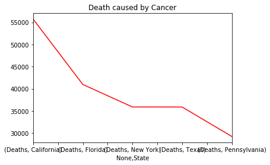
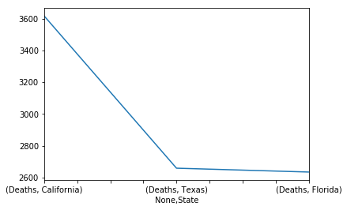
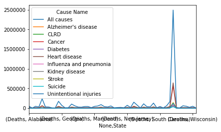
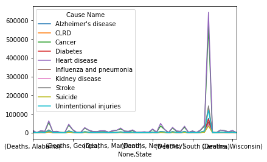
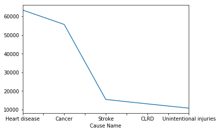
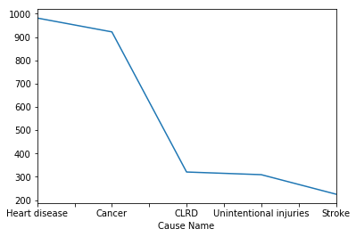

```python
#Source: https://catalog.data.gov/dataset/age-adjusted-death-rates-for-the-top-10-leading-causes-of-death-united-states-2013/resource/0e603f1d-31bf-4809-8f10-a994b305b379
        
import pandas as pd
import numpy as np
import matplotlib.pyplot as plt
import matplotlib
%matplotlib inline
url = "https://data.cdc.gov/api/views/bi63-dtpu/rows.csv?accessType=DOWNLOAD"
data = pd.read_csv(url)#,index_col="Year")
```


```python
data.info() #482.6KB, 412.6KB 14.5% reduction in memory space required
```

    <class 'pandas.core.frame.DataFrame'>
    RangeIndex: 10296 entries, 0 to 10295
    Data columns (total 6 columns):
    Year                       10296 non-null int64
    113 Cause Name             10296 non-null object
    Cause Name                 10296 non-null object
    State                      10296 non-null object
    Deaths                     10296 non-null int64
    Age-adjusted Death Rate    10296 non-null float64
    dtypes: float64(1), int64(2), object(3)
    memory usage: 482.7+ KB


```python
data.sort_index(inplace=True)

```


```python
data.drop("113 Cause Name",axis=1,inplace=True)

```


```python
data["Cause Name"] = data["Cause Name"].astype("category")
```


```python
data
```


<div>
<style scoped>
    .dataframe tbody tr th:only-of-type {
        vertical-align: middle;
    }

    .dataframe tbody tr th {
        vertical-align: top;
    }

    .dataframe thead th {
        text-align: right;
    }
</style>
<table border="1" class="dataframe">
  <thead>
    <tr style="text-align: right;">
      <th></th>
      <th>Year</th>
      <th>Cause Name</th>
      <th>State</th>
      <th>Deaths</th>
      <th>Age-adjusted Death Rate</th>
    </tr>
  </thead>
  <tbody>
    <tr>
      <th>0</th>
      <td>2012</td>
      <td>Kidney disease</td>
      <td>Vermont</td>
      <td>21</td>
      <td>2.6</td>
    </tr>
    <tr>
      <th>1</th>
      <td>2016</td>
      <td>Kidney disease</td>
      <td>Vermont</td>
      <td>30</td>
      <td>3.7</td>
    </tr>
    <tr>
      <th>2</th>
      <td>2013</td>
      <td>Kidney disease</td>
      <td>Vermont</td>
      <td>30</td>
      <td>3.8</td>
    </tr>
    <tr>
      <th>3</th>
      <td>2000</td>
      <td>Suicide</td>
      <td>District of Columbia</td>
      <td>23</td>
      <td>3.8</td>
    </tr>
    <tr>
      <th>4</th>
      <td>2014</td>
      <td>Kidney disease</td>
      <td>Arizona</td>
      <td>325</td>
      <td>4.1</td>
    </tr>
    <tr>
      <th>5</th>
      <td>2009</td>
      <td>Suicide</td>
      <td>District of Columbia</td>
      <td>29</td>
      <td>4.4</td>
    </tr>
    <tr>
      <th>6</th>
      <td>2011</td>
      <td>Kidney disease</td>
      <td>South Dakota</td>
      <td>49</td>
      <td>4.5</td>
    </tr>
    <tr>
      <th>7</th>
      <td>2015</td>
      <td>Kidney disease</td>
      <td>Vermont</td>
      <td>39</td>
      <td>4.5</td>
    </tr>
    <tr>
      <th>8</th>
      <td>2014</td>
      <td>Kidney disease</td>
      <td>Vermont</td>
      <td>37</td>
      <td>4.5</td>
    </tr>
    <tr>
      <th>9</th>
      <td>2013</td>
      <td>Kidney disease</td>
      <td>Arizona</td>
      <td>374</td>
      <td>4.9</td>
    </tr>
    <tr>
      <th>10</th>
      <td>2015</td>
      <td>Suicide</td>
      <td>District of Columbia</td>
      <td>34</td>
      <td>4.9</td>
    </tr>
    <tr>
      <th>11</th>
      <td>2001</td>
      <td>Kidney disease</td>
      <td>Washington</td>
      <td>279</td>
      <td>5.0</td>
    </tr>
    <tr>
      <th>12</th>
      <td>1999</td>
      <td>Suicide</td>
      <td>District of Columbia</td>
      <td>30</td>
      <td>5.1</td>
    </tr>
    <tr>
      <th>13</th>
      <td>1999</td>
      <td>Kidney disease</td>
      <td>Washington</td>
      <td>278</td>
      <td>5.2</td>
    </tr>
    <tr>
      <th>14</th>
      <td>2016</td>
      <td>Suicide</td>
      <td>District of Columbia</td>
      <td>40</td>
      <td>5.2</td>
    </tr>
    <tr>
      <th>15</th>
      <td>2006</td>
      <td>Suicide</td>
      <td>District of Columbia</td>
      <td>30</td>
      <td>5.2</td>
    </tr>
    <tr>
      <th>16</th>
      <td>2002</td>
      <td>Suicide</td>
      <td>District of Columbia</td>
      <td>31</td>
      <td>5.2</td>
    </tr>
    <tr>
      <th>17</th>
      <td>2003</td>
      <td>Kidney disease</td>
      <td>Washington</td>
      <td>304</td>
      <td>5.3</td>
    </tr>
    <tr>
      <th>18</th>
      <td>2011</td>
      <td>Kidney disease</td>
      <td>Vermont</td>
      <td>43</td>
      <td>5.4</td>
    </tr>
    <tr>
      <th>19</th>
      <td>2008</td>
      <td>Kidney disease</td>
      <td>Vermont</td>
      <td>39</td>
      <td>5.4</td>
    </tr>
    <tr>
      <th>20</th>
      <td>2002</td>
      <td>Kidney disease</td>
      <td>Washington</td>
      <td>306</td>
      <td>5.4</td>
    </tr>
    <tr>
      <th>21</th>
      <td>2000</td>
      <td>Kidney disease</td>
      <td>Washington</td>
      <td>293</td>
      <td>5.4</td>
    </tr>
    <tr>
      <th>22</th>
      <td>2005</td>
      <td>Suicide</td>
      <td>District of Columbia</td>
      <td>33</td>
      <td>5.4</td>
    </tr>
    <tr>
      <th>23</th>
      <td>2015</td>
      <td>Kidney disease</td>
      <td>Arizona</td>
      <td>458</td>
      <td>5.5</td>
    </tr>
    <tr>
      <th>24</th>
      <td>2004</td>
      <td>Suicide</td>
      <td>District of Columbia</td>
      <td>33</td>
      <td>5.5</td>
    </tr>
    <tr>
      <th>25</th>
      <td>2011</td>
      <td>Kidney disease</td>
      <td>Arizona</td>
      <td>395</td>
      <td>5.6</td>
    </tr>
    <tr>
      <th>26</th>
      <td>2012</td>
      <td>Kidney disease</td>
      <td>South Dakota</td>
      <td>58</td>
      <td>5.6</td>
    </tr>
    <tr>
      <th>27</th>
      <td>2011</td>
      <td>Suicide</td>
      <td>District of Columbia</td>
      <td>37</td>
      <td>5.6</td>
    </tr>
    <tr>
      <th>28</th>
      <td>2016</td>
      <td>Kidney disease</td>
      <td>Arizona</td>
      <td>487</td>
      <td>5.7</td>
    </tr>
    <tr>
      <th>29</th>
      <td>2012</td>
      <td>Kidney disease</td>
      <td>Arizona</td>
      <td>414</td>
      <td>5.7</td>
    </tr>
    <tr>
      <th>...</th>
      <td>...</td>
      <td>...</td>
      <td>...</td>
      <td>...</td>
      <td>...</td>
    </tr>
    <tr>
      <th>10266</th>
      <td>2002</td>
      <td>All causes</td>
      <td>West Virginia</td>
      <td>21016</td>
      <td>999.0</td>
    </tr>
    <tr>
      <th>10267</th>
      <td>2006</td>
      <td>All causes</td>
      <td>Mississippi</td>
      <td>28564</td>
      <td>999.1</td>
    </tr>
    <tr>
      <th>10268</th>
      <td>2001</td>
      <td>All causes</td>
      <td>West Virginia</td>
      <td>20967</td>
      <td>1000.9</td>
    </tr>
    <tr>
      <th>10269</th>
      <td>2005</td>
      <td>All causes</td>
      <td>Alabama</td>
      <td>47090</td>
      <td>1001.3</td>
    </tr>
    <tr>
      <th>10270</th>
      <td>2001</td>
      <td>All causes</td>
      <td>Alabama</td>
      <td>45316</td>
      <td>1002.1</td>
    </tr>
    <tr>
      <th>10271</th>
      <td>2003</td>
      <td>All causes</td>
      <td>West Virginia</td>
      <td>21306</td>
      <td>1003.1</td>
    </tr>
    <tr>
      <th>10272</th>
      <td>1999</td>
      <td>All causes</td>
      <td>Kentucky</td>
      <td>39321</td>
      <td>1004.1</td>
    </tr>
    <tr>
      <th>10273</th>
      <td>2000</td>
      <td>All causes</td>
      <td>Alabama</td>
      <td>45062</td>
      <td>1004.8</td>
    </tr>
    <tr>
      <th>10274</th>
      <td>2000</td>
      <td>All causes</td>
      <td>Louisiana</td>
      <td>41138</td>
      <td>1006.3</td>
    </tr>
    <tr>
      <th>10275</th>
      <td>2002</td>
      <td>All causes</td>
      <td>Louisiana</td>
      <td>41984</td>
      <td>1008.5</td>
    </tr>
    <tr>
      <th>10276</th>
      <td>1999</td>
      <td>All causes</td>
      <td>Alabama</td>
      <td>44806</td>
      <td>1009.3</td>
    </tr>
    <tr>
      <th>10277</th>
      <td>2002</td>
      <td>All causes</td>
      <td>Kentucky</td>
      <td>40697</td>
      <td>1009.7</td>
    </tr>
    <tr>
      <th>10278</th>
      <td>2000</td>
      <td>All causes</td>
      <td>West Virginia</td>
      <td>21114</td>
      <td>1011.1</td>
    </tr>
    <tr>
      <th>10279</th>
      <td>1999</td>
      <td>All causes</td>
      <td>West Virginia</td>
      <td>21049</td>
      <td>1012.3</td>
    </tr>
    <tr>
      <th>10280</th>
      <td>2001</td>
      <td>All causes</td>
      <td>Louisiana</td>
      <td>41757</td>
      <td>1013.1</td>
    </tr>
    <tr>
      <th>10281</th>
      <td>2002</td>
      <td>All causes</td>
      <td>Alabama</td>
      <td>46069</td>
      <td>1013.4</td>
    </tr>
    <tr>
      <th>10282</th>
      <td>2003</td>
      <td>All causes</td>
      <td>Louisiana</td>
      <td>42719</td>
      <td>1013.7</td>
    </tr>
    <tr>
      <th>10283</th>
      <td>2003</td>
      <td>All causes</td>
      <td>Alabama</td>
      <td>46716</td>
      <td>1020.2</td>
    </tr>
    <tr>
      <th>10284</th>
      <td>1999</td>
      <td>All causes</td>
      <td>Louisiana</td>
      <td>41238</td>
      <td>1021.6</td>
    </tr>
    <tr>
      <th>10285</th>
      <td>2005</td>
      <td>All causes</td>
      <td>Louisiana</td>
      <td>44355</td>
      <td>1023.7</td>
    </tr>
    <tr>
      <th>10286</th>
      <td>2005</td>
      <td>All causes</td>
      <td>Mississippi</td>
      <td>29196</td>
      <td>1028.7</td>
    </tr>
    <tr>
      <th>10287</th>
      <td>2003</td>
      <td>All causes</td>
      <td>Mississippi</td>
      <td>28489</td>
      <td>1031.6</td>
    </tr>
    <tr>
      <th>10288</th>
      <td>2002</td>
      <td>All causes</td>
      <td>District of Columbia</td>
      <td>5851</td>
      <td>1034.1</td>
    </tr>
    <tr>
      <th>10289</th>
      <td>2001</td>
      <td>All causes</td>
      <td>Mississippi</td>
      <td>28259</td>
      <td>1034.3</td>
    </tr>
    <tr>
      <th>10290</th>
      <td>1999</td>
      <td>All causes</td>
      <td>Mississippi</td>
      <td>28185</td>
      <td>1043.4</td>
    </tr>
    <tr>
      <th>10291</th>
      <td>2001</td>
      <td>All causes</td>
      <td>District of Columbia</td>
      <td>5951</td>
      <td>1049.9</td>
    </tr>
    <tr>
      <th>10292</th>
      <td>2002</td>
      <td>All causes</td>
      <td>Mississippi</td>
      <td>28853</td>
      <td>1051.6</td>
    </tr>
    <tr>
      <th>10293</th>
      <td>2000</td>
      <td>All causes</td>
      <td>Mississippi</td>
      <td>28654</td>
      <td>1051.9</td>
    </tr>
    <tr>
      <th>10294</th>
      <td>2000</td>
      <td>All causes</td>
      <td>District of Columbia</td>
      <td>6001</td>
      <td>1061.2</td>
    </tr>
    <tr>
      <th>10295</th>
      <td>1999</td>
      <td>All causes</td>
      <td>District of Columbia</td>
      <td>6076</td>
      <td>1087.3</td>
    </tr>
  </tbody>
</table>
<p>10296 rows × 5 columns</p>
</div>


```python
data["Year"].sort_values(ascending=False)
```


    5147     2016
    3697     2016
    9066     2016
    3403     2016
    3426     2016
    3475     2016
    3514     2016
    3579     2016
    3587     2016
    3601     2016
    3622     2016
    3642     2016
    3677     2016
    3679     2016
    3704     2016
    4008     2016
    3706     2016
    8990     2016
    3783     2016
    3808     2016
    3821     2016
    3824     2016
    8966     2016
    3851     2016
    3925     2016
    3945     2016
    3950     2016
    7582     2016
    3396     2016
    9076     2016
             ... 
    7422     1999
    1988     1999
    10114    1999
    4054     1999
    6945     1999
    4041     1999
    4039     1999
    4133     1999
    4135     1999
    1915     1999
    6992     1999
    1866     1999
    1868     1999
    5331     1999
    8899     1999
    6404     1999
    10100    1999
    4159     1999
    5338     1999
    1890     1999
    1914     1999
    1901     1999
    1902     1999
    8487     1999
    5350     1999
    8906     1999
    1906     1999
    6407     1999
    1911     1999
    10295    1999
    Name: Year, Length: 10296, dtype: int64


```python
cause=data["Deaths"].groupby([data["Year"],data["State"],data["Cause Name"]])
```


```python
my_pivot_deaths = data.pivot_table(values = ["Deaths"],
                 index = ["Cause Name"],
                columns="State")
```


```python
my_pivot_deaths
```


<div>
<style scoped>
    .dataframe tbody tr th:only-of-type {
        vertical-align: middle;
    }

    .dataframe tbody tr th {
        vertical-align: top;
    }

    .dataframe thead tr th {
        text-align: left;
    }

    .dataframe thead tr:last-of-type th {
        text-align: right;
    }
</style>
<table border="1" class="dataframe">
  <thead>
    <tr>
      <th></th>
      <th colspan="21" halign="left">Deaths</th>
    </tr>
    <tr>
      <th>State</th>
      <th>Alabama</th>
      <th>Alaska</th>
      <th>Arizona</th>
      <th>Arkansas</th>
      <th>California</th>
      <th>Colorado</th>
      <th>Connecticut</th>
      <th>Delaware</th>
      <th>District of Columbia</th>
      <th>Florida</th>
      <th>...</th>
      <th>Tennessee</th>
      <th>Texas</th>
      <th>United States</th>
      <th>Utah</th>
      <th>Vermont</th>
      <th>Virginia</th>
      <th>Washington</th>
      <th>West Virginia</th>
      <th>Wisconsin</th>
      <th>Wyoming</th>
    </tr>
    <tr>
      <th>Cause Name</th>
      <th></th>
      <th></th>
      <th></th>
      <th></th>
      <th></th>
      <th></th>
      <th></th>
      <th></th>
      <th></th>
      <th></th>
      <th></th>
      <th></th>
      <th></th>
      <th></th>
      <th></th>
      <th></th>
      <th></th>
      <th></th>
      <th></th>
      <th></th>
      <th></th>
    </tr>
  </thead>
  <tbody>
    <tr>
      <th>All causes</th>
      <td>47823.833333</td>
      <td>3521.000000</td>
      <td>46561.500000</td>
      <td>29053.611111</td>
      <td>239281.277778</td>
      <td>31183.222222</td>
      <td>29518.111111</td>
      <td>7555.277778</td>
      <td>5230.888889</td>
      <td>173951.277778</td>
      <td>...</td>
      <td>59265.111111</td>
      <td>164957.055556</td>
      <td>2.495281e+06</td>
      <td>14472.777778</td>
      <td>5302.388889</td>
      <td>59510.944444</td>
      <td>48093.777778</td>
      <td>21460.888889</td>
      <td>47646.222222</td>
      <td>4303.666667</td>
    </tr>
    <tr>
      <th>Alzheimer's disease</th>
      <td>1479.833333</td>
      <td>66.888889</td>
      <td>1988.833333</td>
      <td>835.722222</td>
      <td>9246.555556</td>
      <td>1171.000000</td>
      <td>751.277778</td>
      <td>184.611111</td>
      <td>111.333333</td>
      <td>4714.222222</td>
      <td>...</td>
      <td>2088.277778</td>
      <td>5120.888889</td>
      <td>7.630067e+04</td>
      <td>435.388889</td>
      <td>212.333333</td>
      <td>1626.500000</td>
      <td>2698.833333</td>
      <td>540.888889</td>
      <td>1607.055556</td>
      <td>126.666667</td>
    </tr>
    <tr>
      <th>CLRD</th>
      <td>2654.333333</td>
      <td>171.833333</td>
      <td>2929.444444</td>
      <td>1734.444444</td>
      <td>13081.500000</td>
      <td>2099.611111</td>
      <td>1423.333333</td>
      <td>408.722222</td>
      <td>145.000000</td>
      <td>9967.444444</td>
      <td>...</td>
      <td>3408.611111</td>
      <td>8546.500000</td>
      <td>1.352626e+05</td>
      <td>640.888889</td>
      <td>331.000000</td>
      <td>2953.944444</td>
      <td>2812.888889</td>
      <td>1422.388889</td>
      <td>2494.500000</td>
      <td>320.611111</td>
    </tr>
    <tr>
      <th>Cancer</th>
      <td>10043.333333</td>
      <td>835.111111</td>
      <td>10275.444444</td>
      <td>6393.000000</td>
      <td>55706.611111</td>
      <td>6769.111111</td>
      <td>6907.055556</td>
      <td>1845.388889</td>
      <td>1159.166667</td>
      <td>40975.111111</td>
      <td>...</td>
      <td>13210.500000</td>
      <td>35883.555556</td>
      <td>5.691409e+05</td>
      <td>2652.555556</td>
      <td>1288.944444</td>
      <td>14039.611111</td>
      <td>11527.055556</td>
      <td>4706.333333</td>
      <td>11070.388889</td>
      <td>922.111111</td>
    </tr>
    <tr>
      <th>Diabetes</th>
      <td>1341.277778</td>
      <td>99.444444</td>
      <td>1401.944444</td>
      <td>834.888889</td>
      <td>7431.611111</td>
      <td>747.000000</td>
      <td>689.611111</td>
      <td>213.722222</td>
      <td>167.555556</td>
      <td>5007.277778</td>
      <td>...</td>
      <td>1751.777778</td>
      <td>5270.333333</td>
      <td>7.313217e+04</td>
      <td>527.500000</td>
      <td>162.277778</td>
      <td>1637.555556</td>
      <td>1547.277778</td>
      <td>789.222222</td>
      <td>1272.333333</td>
      <td>119.222222</td>
    </tr>
    <tr>
      <th>Heart disease</th>
      <td>12635.166667</td>
      <td>672.611111</td>
      <td>10725.722222</td>
      <td>7687.333333</td>
      <td>63432.000000</td>
      <td>6378.666667</td>
      <td>7702.333333</td>
      <td>1913.444444</td>
      <td>1457.500000</td>
      <td>45342.333333</td>
      <td>...</td>
      <td>15142.611111</td>
      <td>40751.722222</td>
      <td>6.430657e+05</td>
      <td>3054.055556</td>
      <td>1278.944444</td>
      <td>14129.611111</td>
      <td>10892.222222</td>
      <td>5421.944444</td>
      <td>11862.611111</td>
      <td>981.555556</td>
    </tr>
    <tr>
      <th>Influenza and pneumonia</th>
      <td>1028.666667</td>
      <td>51.833333</td>
      <td>1011.555556</td>
      <td>756.000000</td>
      <td>6758.944444</td>
      <td>647.944444</td>
      <td>748.666667</td>
      <td>150.444444</td>
      <td>87.222222</td>
      <td>2748.166667</td>
      <td>...</td>
      <td>1557.555556</td>
      <td>3357.000000</td>
      <td>5.772050e+04</td>
      <td>371.611111</td>
      <td>87.388889</td>
      <td>1392.555556</td>
      <td>841.722222</td>
      <td>462.833333</td>
      <td>1103.777778</td>
      <td>117.222222</td>
    </tr>
    <tr>
      <th>Kidney disease</th>
      <td>1049.944444</td>
      <td>40.500000</td>
      <td>520.055556</td>
      <td>636.277778</td>
      <td>2688.111111</td>
      <td>431.055556</td>
      <td>570.666667</td>
      <td>148.944444</td>
      <td>68.611111</td>
      <td>2686.277778</td>
      <td>...</td>
      <td>836.222222</td>
      <td>3120.277778</td>
      <td>4.488778e+04</td>
      <td>241.055556</td>
      <td>47.944444</td>
      <td>1379.666667</td>
      <td>420.833333</td>
      <td>456.166667</td>
      <td>936.611111</td>
      <td>61.666667</td>
    </tr>
    <tr>
      <th>Stroke</th>
      <td>2861.500000</td>
      <td>172.611111</td>
      <td>2337.666667</td>
      <td>1871.444444</td>
      <td>15447.277778</td>
      <td>1701.888889</td>
      <td>1550.555556</td>
      <td>406.166667</td>
      <td>231.555556</td>
      <td>9583.000000</td>
      <td>...</td>
      <td>3553.222222</td>
      <td>9866.500000</td>
      <td>1.433411e+05</td>
      <td>824.111111</td>
      <td>283.388889</td>
      <td>3585.000000</td>
      <td>2999.777778</td>
      <td>1146.666667</td>
      <td>2910.333333</td>
      <td>225.500000</td>
    </tr>
    <tr>
      <th>Suicide</th>
      <td>624.500000</td>
      <td>148.888889</td>
      <td>1014.333333</td>
      <td>432.388889</td>
      <td>3617.333333</td>
      <td>857.055556</td>
      <td>319.833333</td>
      <td>102.611111</td>
      <td>35.722222</td>
      <td>2633.722222</td>
      <td>...</td>
      <td>893.055556</td>
      <td>2658.000000</td>
      <td>3.610239e+04</td>
      <td>433.000000</td>
      <td>93.277778</td>
      <td>937.944444</td>
      <td>913.611111</td>
      <td>290.000000</td>
      <td>716.111111</td>
      <td>116.222222</td>
    </tr>
    <tr>
      <th>Unintentional injuries</th>
      <td>2398.222222</td>
      <td>350.444444</td>
      <td>2997.777778</td>
      <td>1411.222222</td>
      <td>10784.500000</td>
      <td>2110.444444</td>
      <td>1352.555556</td>
      <td>344.833333</td>
      <td>214.388889</td>
      <td>8620.944444</td>
      <td>...</td>
      <td>3283.277778</td>
      <td>8931.500000</td>
      <td>1.209936e+05</td>
      <td>886.055556</td>
      <td>289.722222</td>
      <td>2775.777778</td>
      <td>2578.555556</td>
      <td>1172.500000</td>
      <td>2583.166667</td>
      <td>309.166667</td>
    </tr>
  </tbody>
</table>
<p>11 rows × 52 columns</p>
</div>


```python
cancer = my_pivot_deaths.loc["Cancer"].sort_values(ascending=False)[1:6]

```


```python
cancer.plot(color='red',label="death caused by cancer",title="Death caused by Cancer")
```


    <matplotlib.axes._subplots.AxesSubplot at 0x136811160>





```python
suicide = my_pivot_deaths.loc[("Suicide")].sort_values(ascending=False)[1:4]
suicide
```


            State     
    Deaths  California    3617.333333
            Texas         2658.000000
            Florida       2633.722222
    Name: Suicide, dtype: float64


```python
my_pivot_deaths.loc[("Suicide")].sort_values(ascending=False)[1:4].plot()
```


    <matplotlib.axes._subplots.AxesSubplot at 0x136cf41d0>





```python
my_pivot_deaths.loc[("Diabetes")].sort_values(ascending=False)[1:4]
```


            State     
    Deaths  California    7431.611111
            Texas         5270.333333
            Florida       5007.277778
    Name: Diabetes, dtype: float64


```python
my_pivot_deaths.loc[("Alzheimer's disease")].sort_values(ascending=False)[1:4]
```


            State     
    Deaths  California    9246.555556
            Texas         5120.888889
            Florida       4714.222222
    Name: Alzheimer's disease, dtype: float64


```python
t=my_pivot_deaths.transpose()
```


```python
t
```


<div>
<style scoped>
    .dataframe tbody tr th:only-of-type {
        vertical-align: middle;
    }

    .dataframe tbody tr th {
        vertical-align: top;
    }

    .dataframe thead th {
        text-align: right;
    }
</style>
<table border="1" class="dataframe">
  <thead>
    <tr style="text-align: right;">
      <th></th>
      <th>Cause Name</th>
      <th>All causes</th>
      <th>Alzheimer's disease</th>
      <th>CLRD</th>
      <th>Cancer</th>
      <th>Diabetes</th>
      <th>Heart disease</th>
      <th>Influenza and pneumonia</th>
      <th>Kidney disease</th>
      <th>Stroke</th>
      <th>Suicide</th>
      <th>Unintentional injuries</th>
    </tr>
    <tr>
      <th></th>
      <th>State</th>
      <th></th>
      <th></th>
      <th></th>
      <th></th>
      <th></th>
      <th></th>
      <th></th>
      <th></th>
      <th></th>
      <th></th>
      <th></th>
    </tr>
  </thead>
  <tbody>
    <tr>
      <th rowspan="52" valign="top">Deaths</th>
      <th>Alabama</th>
      <td>4.782383e+04</td>
      <td>1479.833333</td>
      <td>2654.333333</td>
      <td>10043.333333</td>
      <td>1341.277778</td>
      <td>12635.166667</td>
      <td>1028.666667</td>
      <td>1049.944444</td>
      <td>2861.500000</td>
      <td>624.500000</td>
      <td>2398.222222</td>
    </tr>
    <tr>
      <th>Alaska</th>
      <td>3.521000e+03</td>
      <td>66.888889</td>
      <td>171.833333</td>
      <td>835.111111</td>
      <td>99.444444</td>
      <td>672.611111</td>
      <td>51.833333</td>
      <td>40.500000</td>
      <td>172.611111</td>
      <td>148.888889</td>
      <td>350.444444</td>
    </tr>
    <tr>
      <th>Arizona</th>
      <td>4.656150e+04</td>
      <td>1988.833333</td>
      <td>2929.444444</td>
      <td>10275.444444</td>
      <td>1401.944444</td>
      <td>10725.722222</td>
      <td>1011.555556</td>
      <td>520.055556</td>
      <td>2337.666667</td>
      <td>1014.333333</td>
      <td>2997.777778</td>
    </tr>
    <tr>
      <th>Arkansas</th>
      <td>2.905361e+04</td>
      <td>835.722222</td>
      <td>1734.444444</td>
      <td>6393.000000</td>
      <td>834.888889</td>
      <td>7687.333333</td>
      <td>756.000000</td>
      <td>636.277778</td>
      <td>1871.444444</td>
      <td>432.388889</td>
      <td>1411.222222</td>
    </tr>
    <tr>
      <th>California</th>
      <td>2.392813e+05</td>
      <td>9246.555556</td>
      <td>13081.500000</td>
      <td>55706.611111</td>
      <td>7431.611111</td>
      <td>63432.000000</td>
      <td>6758.944444</td>
      <td>2688.111111</td>
      <td>15447.277778</td>
      <td>3617.333333</td>
      <td>10784.500000</td>
    </tr>
    <tr>
      <th>Colorado</th>
      <td>3.118322e+04</td>
      <td>1171.000000</td>
      <td>2099.611111</td>
      <td>6769.111111</td>
      <td>747.000000</td>
      <td>6378.666667</td>
      <td>647.944444</td>
      <td>431.055556</td>
      <td>1701.888889</td>
      <td>857.055556</td>
      <td>2110.444444</td>
    </tr>
    <tr>
      <th>Connecticut</th>
      <td>2.951811e+04</td>
      <td>751.277778</td>
      <td>1423.333333</td>
      <td>6907.055556</td>
      <td>689.611111</td>
      <td>7702.333333</td>
      <td>748.666667</td>
      <td>570.666667</td>
      <td>1550.555556</td>
      <td>319.833333</td>
      <td>1352.555556</td>
    </tr>
    <tr>
      <th>Delaware</th>
      <td>7.555278e+03</td>
      <td>184.611111</td>
      <td>408.722222</td>
      <td>1845.388889</td>
      <td>213.722222</td>
      <td>1913.444444</td>
      <td>150.444444</td>
      <td>148.944444</td>
      <td>406.166667</td>
      <td>102.611111</td>
      <td>344.833333</td>
    </tr>
    <tr>
      <th>District of Columbia</th>
      <td>5.230889e+03</td>
      <td>111.333333</td>
      <td>145.000000</td>
      <td>1159.166667</td>
      <td>167.555556</td>
      <td>1457.500000</td>
      <td>87.222222</td>
      <td>68.611111</td>
      <td>231.555556</td>
      <td>35.722222</td>
      <td>214.388889</td>
    </tr>
    <tr>
      <th>Florida</th>
      <td>1.739513e+05</td>
      <td>4714.222222</td>
      <td>9967.444444</td>
      <td>40975.111111</td>
      <td>5007.277778</td>
      <td>45342.333333</td>
      <td>2748.166667</td>
      <td>2686.277778</td>
      <td>9583.000000</td>
      <td>2633.722222</td>
      <td>8620.944444</td>
    </tr>
    <tr>
      <th>Georgia</th>
      <td>6.994767e+04</td>
      <td>2035.111111</td>
      <td>3654.000000</td>
      <td>15051.111111</td>
      <td>1803.500000</td>
      <td>16791.000000</td>
      <td>1538.666667</td>
      <td>1584.277778</td>
      <td>4024.444444</td>
      <td>1064.388889</td>
      <td>3741.111111</td>
    </tr>
    <tr>
      <th>Hawaii</th>
      <td>9.571833e+03</td>
      <td>223.388889</td>
      <td>298.555556</td>
      <td>2197.611111</td>
      <td>248.277778</td>
      <td>2396.055556</td>
      <td>311.166667</td>
      <td>176.277778</td>
      <td>690.055556</td>
      <td>154.000000</td>
      <td>436.555556</td>
    </tr>
    <tr>
      <th>Idaho</th>
      <td>1.112056e+04</td>
      <td>380.833333</td>
      <td>698.944444</td>
      <td>2445.944444</td>
      <td>349.944444</td>
      <td>2533.055556</td>
      <td>238.166667</td>
      <td>135.111111</td>
      <td>679.833333</td>
      <td>258.222222</td>
      <td>663.277778</td>
    </tr>
    <tr>
      <th>Illinois</th>
      <td>1.040107e+05</td>
      <td>2818.444444</td>
      <td>5156.722222</td>
      <td>24462.444444</td>
      <td>2860.888889</td>
      <td>27352.111111</td>
      <td>2608.444444</td>
      <td>2408.777778</td>
      <td>6128.500000</td>
      <td>1173.222222</td>
      <td>4326.833333</td>
    </tr>
    <tr>
      <th>Indiana</th>
      <td>5.731589e+04</td>
      <td>1804.888889</td>
      <td>3607.833333</td>
      <td>13058.444444</td>
      <td>1742.555556</td>
      <td>14423.333333</td>
      <td>1172.777778</td>
      <td>1301.055556</td>
      <td>3338.777778</td>
      <td>820.888889</td>
      <td>2588.944444</td>
    </tr>
    <tr>
      <th>Iowa</th>
      <td>2.818178e+04</td>
      <td>1142.555556</td>
      <td>1743.611111</td>
      <td>6420.888889</td>
      <td>768.500000</td>
      <td>7362.222222</td>
      <td>778.555556</td>
      <td>289.500000</td>
      <td>1761.166667</td>
      <td>364.000000</td>
      <td>1270.388889</td>
    </tr>
    <tr>
      <th>Kansas</th>
      <td>2.493733e+04</td>
      <td>784.111111</td>
      <td>1540.833333</td>
      <td>5394.500000</td>
      <td>688.055556</td>
      <td>5922.277778</td>
      <td>649.444444</td>
      <td>546.555556</td>
      <td>1541.222222</td>
      <td>388.277778</td>
      <td>1240.611111</td>
    </tr>
    <tr>
      <th>Kentucky</th>
      <td>4.181417e+04</td>
      <td>1258.611111</td>
      <td>2740.555556</td>
      <td>9665.388889</td>
      <td>1228.388889</td>
      <td>10574.055556</td>
      <td>1004.611111</td>
      <td>914.777778</td>
      <td>2232.555556</td>
      <td>621.388889</td>
      <td>2413.611111</td>
    </tr>
    <tr>
      <th>Louisiana</th>
      <td>4.199761e+04</td>
      <td>1344.944444</td>
      <td>1887.666667</td>
      <td>9279.666667</td>
      <td>1469.166667</td>
      <td>10717.888889</td>
      <td>885.833333</td>
      <td>1106.277778</td>
      <td>2302.111111</td>
      <td>548.611111</td>
      <td>2307.000000</td>
    </tr>
    <tr>
      <th>Maine</th>
      <td>1.288011e+04</td>
      <td>476.000000</td>
      <td>824.055556</td>
      <td>3168.277778</td>
      <td>379.444444</td>
      <td>2932.166667</td>
      <td>279.777778</td>
      <td>241.777778</td>
      <td>704.611111</td>
      <td>190.111111</td>
      <td>588.222222</td>
    </tr>
    <tr>
      <th>Maryland</th>
      <td>4.447344e+04</td>
      <td>929.055556</td>
      <td>1969.222222</td>
      <td>10398.444444</td>
      <td>1334.333333</td>
      <td>11474.666667</td>
      <td>1061.944444</td>
      <td>714.166667</td>
      <td>2539.611111</td>
      <td>518.388889</td>
      <td>1526.444444</td>
    </tr>
    <tr>
      <th>Massachusetts</th>
      <td>5.483756e+04</td>
      <td>1646.666667</td>
      <td>2639.833333</td>
      <td>13223.944444</td>
      <td>1238.944444</td>
      <td>13158.833333</td>
      <td>1651.944444</td>
      <td>1275.722222</td>
      <td>2894.277778</td>
      <td>513.944444</td>
      <td>2074.555556</td>
    </tr>
    <tr>
      <th>Michigan</th>
      <td>8.888633e+04</td>
      <td>2605.944444</td>
      <td>4861.500000</td>
      <td>20227.611111</td>
      <td>2747.944444</td>
      <td>24974.055556</td>
      <td>1848.611111</td>
      <td>1645.722222</td>
      <td>4990.555556</td>
      <td>1173.722222</td>
      <td>3773.611111</td>
    </tr>
    <tr>
      <th>Minnesota</th>
      <td>3.901639e+04</td>
      <td>1388.111111</td>
      <td>2032.833333</td>
      <td>9345.611111</td>
      <td>1179.722222</td>
      <td>7906.166667</td>
      <td>739.166667</td>
      <td>698.055556</td>
      <td>2359.833333</td>
      <td>584.000000</td>
      <td>2095.833333</td>
    </tr>
    <tr>
      <th>Mississippi</th>
      <td>2.923089e+04</td>
      <td>824.888889</td>
      <td>1551.722222</td>
      <td>6219.444444</td>
      <td>826.444444</td>
      <td>8177.722222</td>
      <td>690.388889</td>
      <td>679.722222</td>
      <td>1666.444444</td>
      <td>366.555556</td>
      <td>1715.277778</td>
    </tr>
    <tr>
      <th>Missouri</th>
      <td>5.601806e+04</td>
      <td>1666.277778</td>
      <td>3324.888889</td>
      <td>12546.388889</td>
      <td>1476.888889</td>
      <td>15127.388889</td>
      <td>1398.444444</td>
      <td>1197.222222</td>
      <td>3324.944444</td>
      <td>836.055556</td>
      <td>2911.777778</td>
    </tr>
    <tr>
      <th>Montana</th>
      <td>8.804444e+03</td>
      <td>258.888889</td>
      <td>612.222222</td>
      <td>1945.611111</td>
      <td>251.444444</td>
      <td>1947.611111</td>
      <td>190.555556</td>
      <td>119.388889</td>
      <td>502.000000</td>
      <td>209.555556</td>
      <td>561.333333</td>
    </tr>
    <tr>
      <th>Nebraska</th>
      <td>1.544422e+04</td>
      <td>511.000000</td>
      <td>981.222222</td>
      <td>3413.055556</td>
      <td>444.611111</td>
      <td>3646.444444</td>
      <td>354.500000</td>
      <td>256.666667</td>
      <td>931.333333</td>
      <td>199.388889</td>
      <td>712.500000</td>
    </tr>
    <tr>
      <th>Nevada</th>
      <td>1.918233e+04</td>
      <td>359.944444</td>
      <td>1259.277778</td>
      <td>4377.444444</td>
      <td>359.555556</td>
      <td>4957.944444</td>
      <td>464.444444</td>
      <td>394.888889</td>
      <td>928.722222</td>
      <td>492.611111</td>
      <td>1057.888889</td>
    </tr>
    <tr>
      <th>New Hampshire</th>
      <td>1.044444e+04</td>
      <td>360.555556</td>
      <td>630.611111</td>
      <td>2585.722222</td>
      <td>293.888889</td>
      <td>2544.611111</td>
      <td>217.722222</td>
      <td>158.111111</td>
      <td>526.944444</td>
      <td>176.333333</td>
      <td>521.222222</td>
    </tr>
    <tr>
      <th>New Jersey</th>
      <td>7.175422e+04</td>
      <td>1764.277778</td>
      <td>3076.166667</td>
      <td>17101.833333</td>
      <td>2272.500000</td>
      <td>20035.166667</td>
      <td>1507.055556</td>
      <td>1568.222222</td>
      <td>3625.555556</td>
      <td>636.000000</td>
      <td>2628.500000</td>
    </tr>
    <tr>
      <th>New Mexico</th>
      <td>1.564517e+04</td>
      <td>364.166667</td>
      <td>943.222222</td>
      <td>3233.944444</td>
      <td>604.111111</td>
      <td>3377.666667</td>
      <td>340.444444</td>
      <td>248.388889</td>
      <td>767.277778</td>
      <td>392.833333</td>
      <td>1260.833333</td>
    </tr>
    <tr>
      <th>New York</th>
      <td>1.523099e+05</td>
      <td>2254.444444</td>
      <td>6851.833333</td>
      <td>35891.222222</td>
      <td>3912.055556</td>
      <td>49726.666667</td>
      <td>4938.833333</td>
      <td>2352.333333</td>
      <td>6692.555556</td>
      <td>1418.500000</td>
      <td>5275.833333</td>
    </tr>
    <tr>
      <th>North Carolina</th>
      <td>7.772294e+04</td>
      <td>2569.055556</td>
      <td>4326.500000</td>
      <td>17472.777778</td>
      <td>2303.944444</td>
      <td>17952.611111</td>
      <td>1827.388889</td>
      <td>1623.777778</td>
      <td>4856.666667</td>
      <td>1135.333333</td>
      <td>4166.333333</td>
    </tr>
    <tr>
      <th>North Dakota</th>
      <td>5.965389e+03</td>
      <td>322.666667</td>
      <td>311.444444</td>
      <td>1308.388889</td>
      <td>200.666667</td>
      <td>1482.722222</td>
      <td>150.444444</td>
      <td>85.777778</td>
      <td>388.666667</td>
      <td>98.000000</td>
      <td>298.722222</td>
    </tr>
    <tr>
      <th>Ohio</th>
      <td>1.104061e+05</td>
      <td>3539.055556</td>
      <td>6502.611111</td>
      <td>25115.333333</td>
      <td>3651.333333</td>
      <td>28564.888889</td>
      <td>2263.166667</td>
      <td>1950.000000</td>
      <td>6230.555556</td>
      <td>1358.777778</td>
      <td>4925.055556</td>
    </tr>
    <tr>
      <th>Oklahoma</th>
      <td>3.647450e+04</td>
      <td>993.500000</td>
      <td>2396.277778</td>
      <td>7689.000000</td>
      <td>1166.222222</td>
      <td>10142.722222</td>
      <td>826.777778</td>
      <td>574.611111</td>
      <td>2119.055556</td>
      <td>595.166667</td>
      <td>2088.444444</td>
    </tr>
    <tr>
      <th>Oregon</th>
      <td>3.199794e+04</td>
      <td>1258.000000</td>
      <td>1897.388889</td>
      <td>7484.944444</td>
      <td>1068.388889</td>
      <td>6712.333333</td>
      <td>525.333333</td>
      <td>342.888889</td>
      <td>2127.388889</td>
      <td>620.500000</td>
      <td>1590.777778</td>
    </tr>
    <tr>
      <th>Pennsylvania</th>
      <td>1.285491e+05</td>
      <td>3318.888889</td>
      <td>6269.777778</td>
      <td>29244.444444</td>
      <td>3597.444444</td>
      <td>34727.111111</td>
      <td>2763.333333</td>
      <td>2919.888889</td>
      <td>7415.333333</td>
      <td>1549.055556</td>
      <td>5739.000000</td>
    </tr>
    <tr>
      <th>Rhode Island</th>
      <td>9.796500e+03</td>
      <td>319.222222</td>
      <td>493.111111</td>
      <td>2288.611111</td>
      <td>241.444444</td>
      <td>2679.666667</td>
      <td>242.944444</td>
      <td>149.555556</td>
      <td>480.500000</td>
      <td>101.777778</td>
      <td>434.722222</td>
    </tr>
    <tr>
      <th>South Carolina</th>
      <td>4.070167e+04</td>
      <td>1445.166667</td>
      <td>2206.666667</td>
      <td>9061.444444</td>
      <td>1181.944444</td>
      <td>9499.666667</td>
      <td>772.444444</td>
      <td>801.555556</td>
      <td>2557.833333</td>
      <td>580.444444</td>
      <td>2259.666667</td>
    </tr>
    <tr>
      <th>South Dakota</th>
      <td>7.149500e+03</td>
      <td>324.888889</td>
      <td>424.444444</td>
      <td>1611.000000</td>
      <td>227.777778</td>
      <td>1782.500000</td>
      <td>196.055556</td>
      <td>85.833333</td>
      <td>453.611111</td>
      <td>124.722222</td>
      <td>403.611111</td>
    </tr>
    <tr>
      <th>Tennessee</th>
      <td>5.926511e+04</td>
      <td>2088.277778</td>
      <td>3408.611111</td>
      <td>13210.500000</td>
      <td>1751.777778</td>
      <td>15142.611111</td>
      <td>1557.555556</td>
      <td>836.222222</td>
      <td>3553.222222</td>
      <td>893.055556</td>
      <td>3283.277778</td>
    </tr>
    <tr>
      <th>Texas</th>
      <td>1.649571e+05</td>
      <td>5120.888889</td>
      <td>8546.500000</td>
      <td>35883.555556</td>
      <td>5270.333333</td>
      <td>40751.722222</td>
      <td>3357.000000</td>
      <td>3120.277778</td>
      <td>9866.500000</td>
      <td>2658.000000</td>
      <td>8931.500000</td>
    </tr>
    <tr>
      <th>United States</th>
      <td>2.495281e+06</td>
      <td>76300.666667</td>
      <td>135262.555556</td>
      <td>569140.888889</td>
      <td>73132.166667</td>
      <td>643065.722222</td>
      <td>57720.500000</td>
      <td>44887.777778</td>
      <td>143341.111111</td>
      <td>36102.388889</td>
      <td>120993.555556</td>
    </tr>
    <tr>
      <th>Utah</th>
      <td>1.447278e+04</td>
      <td>435.388889</td>
      <td>640.888889</td>
      <td>2652.555556</td>
      <td>527.500000</td>
      <td>3054.055556</td>
      <td>371.611111</td>
      <td>241.055556</td>
      <td>824.111111</td>
      <td>433.000000</td>
      <td>886.055556</td>
    </tr>
    <tr>
      <th>Vermont</th>
      <td>5.302389e+03</td>
      <td>212.333333</td>
      <td>331.000000</td>
      <td>1288.944444</td>
      <td>162.277778</td>
      <td>1278.944444</td>
      <td>87.388889</td>
      <td>47.944444</td>
      <td>283.388889</td>
      <td>93.277778</td>
      <td>289.722222</td>
    </tr>
    <tr>
      <th>Virginia</th>
      <td>5.951094e+04</td>
      <td>1626.500000</td>
      <td>2953.944444</td>
      <td>14039.611111</td>
      <td>1637.555556</td>
      <td>14129.611111</td>
      <td>1392.555556</td>
      <td>1379.666667</td>
      <td>3585.000000</td>
      <td>937.944444</td>
      <td>2775.777778</td>
    </tr>
    <tr>
      <th>Washington</th>
      <td>4.809378e+04</td>
      <td>2698.833333</td>
      <td>2812.888889</td>
      <td>11527.055556</td>
      <td>1547.277778</td>
      <td>10892.222222</td>
      <td>841.722222</td>
      <td>420.833333</td>
      <td>2999.777778</td>
      <td>913.611111</td>
      <td>2578.555556</td>
    </tr>
    <tr>
      <th>West Virginia</th>
      <td>2.146089e+04</td>
      <td>540.888889</td>
      <td>1422.388889</td>
      <td>4706.333333</td>
      <td>789.222222</td>
      <td>5421.944444</td>
      <td>462.833333</td>
      <td>456.166667</td>
      <td>1146.666667</td>
      <td>290.000000</td>
      <td>1172.500000</td>
    </tr>
    <tr>
      <th>Wisconsin</th>
      <td>4.764622e+04</td>
      <td>1607.055556</td>
      <td>2494.500000</td>
      <td>11070.388889</td>
      <td>1272.333333</td>
      <td>11862.611111</td>
      <td>1103.777778</td>
      <td>936.611111</td>
      <td>2910.333333</td>
      <td>716.111111</td>
      <td>2583.166667</td>
    </tr>
    <tr>
      <th>Wyoming</th>
      <td>4.303667e+03</td>
      <td>126.666667</td>
      <td>320.611111</td>
      <td>922.111111</td>
      <td>119.222222</td>
      <td>981.555556</td>
      <td>117.222222</td>
      <td>61.666667</td>
      <td>225.500000</td>
      <td>116.222222</td>
      <td>309.166667</td>
    </tr>
  </tbody>
</table>
</div>


```python
t.loc[("Deaths","Wisconsin")].sort_values()
```


    Cause Name
    Suicide                      716.111111
    Kidney disease               936.611111
    Influenza and pneumonia     1103.777778
    Diabetes                    1272.333333
    Alzheimer's disease         1607.055556
    CLRD                        2494.500000
    Unintentional injuries      2583.166667
    Stroke                      2910.333333
    Cancer                     11070.388889
    Heart disease              11862.611111
    All causes                 47646.222222
    Name: (Deaths, Wisconsin), dtype: float64


```python
t.loc[("Deaths","California")].sort_values(ascending=False)[1:4]
```


    Cause Name
    Heart disease    63432.000000
    Cancer           55706.611111
    Stroke           15447.277778
    Name: (Deaths, California), dtype: float64


```python
t.loc[("Deaths","Kansas")].sort_values(ascending=False)[1:4]
```


    Cause Name
    Heart disease    5922.277778
    Cancer           5394.500000
    Stroke           1541.222222
    Name: (Deaths, Kansas), dtype: float64


```python
t.loc[("Deaths","Wyoming")].sort_values(ascending=True)[1:4]
```


    Cause Name
    Suicide                    116.222222
    Influenza and pneumonia    117.222222
    Diabetes                   119.222222
    Name: (Deaths, Wyoming), dtype: float64


```python
t.loc[("Deaths","Arkansas")].sort_values(ascending=True)[1:4]
```


    Cause Name
    Kidney disease             636.277778
    Influenza and pneumonia    756.000000
    Diabetes                   834.888889
    Name: (Deaths, Arkansas), dtype: float64


```python
t.loc[("Deaths","Wisconsin")].sort_values(ascending=False)[1:4]
```


    Cause Name
    Heart disease    11862.611111
    Cancer           11070.388889
    Stroke            2910.333333
    Name: (Deaths, Wisconsin), dtype: float64


```python
t["All causes"].sort_values(ascending=False)
```


            State               
    Deaths  United States           2.495281e+06
            California              2.392813e+05
            Florida                 1.739513e+05
            Texas                   1.649571e+05
            New York                1.523099e+05
            Pennsylvania            1.285491e+05
            Ohio                    1.104061e+05
            Illinois                1.040107e+05
            Michigan                8.888633e+04
            North Carolina          7.772294e+04
            New Jersey              7.175422e+04
            Georgia                 6.994767e+04
            Virginia                5.951094e+04
            Tennessee               5.926511e+04
            Indiana                 5.731589e+04
            Missouri                5.601806e+04
            Massachusetts           5.483756e+04
            Washington              4.809378e+04
            Alabama                 4.782383e+04
            Wisconsin               4.764622e+04
            Arizona                 4.656150e+04
            Maryland                4.447344e+04
            Louisiana               4.199761e+04
            Kentucky                4.181417e+04
            South Carolina          4.070167e+04
            Minnesota               3.901639e+04
            Oklahoma                3.647450e+04
            Oregon                  3.199794e+04
            Colorado                3.118322e+04
            Connecticut             2.951811e+04
            Mississippi             2.923089e+04
            Arkansas                2.905361e+04
            Iowa                    2.818178e+04
            Kansas                  2.493733e+04
            West Virginia           2.146089e+04
            Nevada                  1.918233e+04
            New Mexico              1.564517e+04
            Nebraska                1.544422e+04
            Utah                    1.447278e+04
            Maine                   1.288011e+04
            Idaho                   1.112056e+04
            New Hampshire           1.044444e+04
            Rhode Island            9.796500e+03
            Hawaii                  9.571833e+03
            Montana                 8.804444e+03
            Delaware                7.555278e+03
            South Dakota            7.149500e+03
            North Dakota            5.965389e+03
            Vermont                 5.302389e+03
            District of Columbia    5.230889e+03
            Wyoming                 4.303667e+03
            Alaska                  3.521000e+03
    Name: All causes, dtype: float64


```python
tt=t.drop("All causes",axis=1)
t.plot()
```


    <matplotlib.axes._subplots.AxesSubplot at 0x137acf400>





```python
tt.plot()
```


    <matplotlib.axes._subplots.AxesSubplot at 0x136d6a320>





```python
tt.loc[("Deaths","California")].nlargest(5).plot()
```


    <matplotlib.axes._subplots.AxesSubplot at 0x137056390>





```python
tt.loc[("Deaths","Wyoming")].nlargest(5).plot()
```


    <matplotlib.axes._subplots.AxesSubplot at 0x13752cdd8>





```python
my_pivot_deaths.columns
```


    MultiIndex(levels=[['Deaths'], ['Alabama', 'Alaska', 'Arizona', 'Arkansas', 'California', 'Colorado', 'Connecticut', 'Delaware', 'District of Columbia', 'Florida', 'Georgia', 'Hawaii', 'Idaho', 'Illinois', 'Indiana', 'Iowa', 'Kansas', 'Kentucky', 'Louisiana', 'Maine', 'Maryland', 'Massachusetts', 'Michigan', 'Minnesota', 'Mississippi', 'Missouri', 'Montana', 'Nebraska', 'Nevada', 'New Hampshire', 'New Jersey', 'New Mexico', 'New York', 'North Carolina', 'North Dakota', 'Ohio', 'Oklahoma', 'Oregon', 'Pennsylvania', 'Rhode Island', 'South Carolina', 'South Dakota', 'Tennessee', 'Texas', 'United States', 'Utah', 'Vermont', 'Virginia', 'Washington', 'West Virginia', 'Wisconsin', 'Wyoming']],
               codes=[[0, 0, 0, 0, 0, 0, 0, 0, 0, 0, 0, 0, 0, 0, 0, 0, 0, 0, 0, 0, 0, 0, 0, 0, 0, 0, 0, 0, 0, 0, 0, 0, 0, 0, 0, 0, 0, 0, 0, 0, 0, 0, 0, 0, 0, 0, 0, 0, 0, 0, 0, 0], [0, 1, 2, 3, 4, 5, 6, 7, 8, 9, 10, 11, 12, 13, 14, 15, 16, 17, 18, 19, 20, 21, 22, 23, 24, 25, 26, 27, 28, 29, 30, 31, 32, 33, 34, 35, 36, 37, 38, 39, 40, 41, 42, 43, 44, 45, 46, 47, 48, 49, 50, 51]],
               names=[None, 'State'])


```python
my_pivot_deaths.index
```


    CategoricalIndex(['All causes', 'Alzheimer's disease', 'CLRD', 'Cancer',
                      'Diabetes', 'Heart disease', 'Influenza and pneumonia',
                      'Kidney disease', 'Stroke', 'Suicide',
                      'Unintentional injuries'],
                     categories=['All causes', 'Alzheimer's disease', 'CLRD', 'Cancer', 'Diabetes', 'Heart disease', 'Influenza and pneumonia', 'Kidney disease', ...], ordered=False, name='Cause Name', dtype='category')


```python

```


```python

```


```python

```


```python

```


```python

```


```python

```


```python

```


```python

```


```python

```
